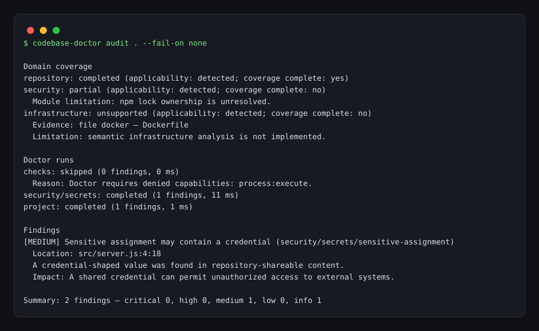

# Codebase Doctor

[](https://www.npmjs.com/package/codebase-doctor)
[](https://www.npmjs.com/package/codebase-doctor)
[](https://github.com/subhajitlucky/codebase-doctor/actions/workflows/ci.yml)

**Models build. Codebase Doctor verifies.**

> It finds the thing, and it never guesses.

Most repository scanners fail in one of two ways: they flood you with false positives, or they silently skip the hard case and report "clean." Codebase Doctor does neither. Every finding carries evidence, every audit reports what it *couldn't* analyze, and a clean run means the scope was actually checked.

```bash
npx -y codebase-doctor audit . --changed --format brief
```

```txt
codebase-doctor brief
scope=full findings=1 shown=1 coverage=incomplete score=80
[high] security/secrets/provider-token src/config.ts:12 —
  Have an authorized human or external coding agent remove the value and rotate it,
  then rerun the audit.
coverage-limitations: validation: skipped, database: skipped, security: partial
```

That last line is the point. Most tools print findings and stop. This one tells you what it *didn't* check, every single run.



---

## Why this exists

Coding agents ship code faster than review can keep up. The failure isn't that agents can't write code — it's that nothing **verifies** what they wrote before it merges.

Codebase Doctor is that verification step. It builds a source graph, scans for committed secrets, dependency drift, unsafe Dockerfiles, workflow injection, RLS mistakes, and accessibility regressions — then tells you exactly what it could not verify.

**Benchmarked, not vibes**: 17 seeded single-defect fixtures score **100% rule recall and zero medium+ false positives** ([results](docs/benchmark-results.md), reproducible with `npm run benchmark`).

**Field study**: of 100 agent-configured public repositories, **23% ship at least one high-severity finding** — 10% have broken imports, 4% committed key material, 11% risky agent configuration ([report](docs/blog/2026-10-09-agent-repo-audit.md), anonymized and reproducible).

## Install

```bash
npx -y codebase-doctor audit .          # no install
npm install -g codebase-doctor         # global
```

## Quick start

```bash
codebase-doctor demo                             # disposable fixture: secret, broken import, blast radius
codebase-doctor audit . --json                   # full audit
codebase-doctor audit . --changed --json         # just my diff
codebase-doctor audit . --changed --base main --json    # PR review
codebase-doctor audit . --format sarif           # GitHub code scanning
codebase-doctor audit . --format html > report.html     # shareable standalone report
codebase-doctor verify . --baseline before.json  # confirm fixes landed
```

`demo` needs no configuration and no repository: it builds a disposable git
fixture with a tracked secret and a broken import, audits the simulated agent
edit with the real pipeline, prints the blast radius, and exits 1 to show the
CI gate. Nothing outside a temp directory is touched.

## Options

```text
--run-checks          Permit configured validation commands
--changed             Audit Git changes and their affected scope (implied by review)
--base <ref>          Compare changed scope from the merge base with this ref
--json                Emit schema-versioned JSON
--format <format>     Output format: text, json, sarif, brief, or html (review adds markdown, github)
--all-findings        Review only: include findings outside the changed lines
--output <file>       Review only: write the report to a file as well as stdout
--exclude <glob>      Exclude a repository-relative path glob; repeatable
--baseline <path>     Compare with a prior Codebase Doctor JSON report
--timeout <ms>        Per-command timeout (default: 120000)
--fail-on <severity>  info|low|medium|high|critical|none (default: high)
--require-complete    Exit 2 when audit coverage is incomplete
--max-findings <n>    Cap brief output (default: 100)
--score               Print only the Repo Health score
--badge               Print a shields.io badge URL for the Repo Health score
--with-database       Permit live PostgreSQL catalog access
--with-advisories     Opt-in OSV advisory lookup over lockfile packages
--database-schema     Schema to inspect; repeatable (default: public)
--database-timeout    Catalog statement timeout in ms (default: 10000)
```

## Code review

`review` is the pull-request command. It always audits changed scope, narrows
findings to added diff lines, and prints a verdict — `APPROVE`, `COMMENT`, or
`REQUEST_CHANGES` — so unrelated old issues never fail a PR:

```bash
codebase-doctor review . --base origin/main --format markdown > review.md
codebase-doctor review . --base origin/main --format github
codebase-doctor review . --format json  # includes a machine-readable review envelope
```

- `--format markdown` renders a PR-comment-ready body with the verdict,
  findings, source impact, and coverage limitations.
- `--format github` emits `::error` / `::warning` / `::notice` workflow
  commands that annotate pull-request diffs inline from Actions logs, with no
  network access.
- A finding on an unchanged line is out of scope for the verdict and counted
  as omitted; the full `audit` still reports it. `--all-findings` disables
  narrowing, and `--output <file>` writes the report to a file as well as
  stdout.
- With `--baseline`, only *new* findings in the diff gate the verdict.
- Exit `1` means the review requests changes; exit `2` is an operational
  failure, never a clean result. Inspect coverage before calling the reviewed
  diff verified or clean.

## GitHub Action

```yaml
permissions:
  contents: read
  security-events: write

steps:
  - uses: actions/checkout@v4
  - uses: subhajitlucky/codebase-doctor@v0.1.10
    with:
      format: sarif
      upload: "true"
      fail-on: high
```

Findings appear in the Security tab. See [docs/github-action.md](docs/github-action.md).

---

## What it checks

### Secrets — working tree and history

Precision-first and not exhaustive: it detects private-key material, provider-token shapes, paired AWS credentials, credential-bearing URLs, and high-confidence sensitive assignments. A Git-ignored `.env` is normal storage and is **not** a finding; a tracked one containing a real credential is.

`security/secrets-history` catches the case that matters most: a secret committed and later deleted from the working tree, so a rotated-looking repo doesn't hide an exposure. It inspects the most recent 200 commits across all branches without ever checking out, rewriting, or executing repository content. Changed audits scope the history log to changed paths, so deleting a leaked file cannot review clean.

**Matched values are withheld from every finding, fingerprint, error, and report.** Codebase Doctor never prints your secrets — including in its own SARIF. An external authorized human or agent must remediate the shareable content and rotate or revoke the credential, then rerun the same audit.

### Dependencies

`security/dependencies` is read-only and offline. Lockfile-aware for npm lockfile versions 2 and 3, pnpm (v5+), Yarn (classic and Berry), Bun, and Python poetry and uv locks. Remaining ecosystems stay explicitly unsupported rather than receiving guessed findings.

Rule families: `security/dependencies/missing-lockfile`, `security/dependencies/manifest-lock-drift`, `security/dependencies/insecure-source`, `security/dependencies/mutable-git-source`, `security/dependencies/missing-integrity`, `security/dependencies/workspace-registry-resolution`, `security/dependencies/competing-npm-lockfiles`, and `security/dependencies/competing-lockfiles`.

A normal semver range such as `^5.0.0` is **not** a finding when the lock agrees. Raw dependency specifications and resolved URLs are withheld from reports and never enter a fingerprint. An external authorized human or agent must correct the metadata and rerun the same scope. Inspect coverage before calling the dependency graph clean or verified.

It never invokes npm, another package manager, a shell, an installer, or a lifecycle script, and makes no network request. It makes no CVE or advisory claim on its own. Python coverage parses `poetry.lock` and `uv.lock` package blocks and `pyproject.toml` Poetry and PEP 621 declarations with a bounded line scanner (no TOML dependency): insecure transports, unpinned git references, missing hash evidence, missing lockfiles, competing lockfiles, and decidable manifest-lock drift are reported, while undecidable specifiers, markers, direct-URL drift, transitive-only entries, and requirements-only layouts stay visible as partial coverage.

`--with-advisories` performs one bounded OSV lookup against resolved packages. Only names, versions, and ecosystems leave the machine.

### Source impact — what breaks if I change this file

`repository/source-graph` uses a real syntax parser (never executes your code) to build a static import graph across **JS/TS, Python, Go, Java, and Rust**. In changed mode it walks reverse edges and reports a deterministic shortest impact path from each changed file.

Changed mode is mixed-scope per doctor, not a universal file filter: Project Doctor structural rules run with the full repository snapshot and may report findings outside changed paths for manifests, lockfiles, workspaces, and test visibility. File-local doctors (backend, frontend, infrastructure, agent surface, performance) examine only changed files present in the inventory, so changed audits stay proportional to the change. Configured validation check plans are built from full project topology and then filtered to `affectedProjectIds`. Static SQL selects affected migration streams and replays full current history for every selected stream. Live database remains a full observed schema-set audit only with separately requested `--with-database`. Zero changed findings is not a full clean result.

`repository/source-graph` recognizes static `import`, re-export, type-only import, literal `require`, and literal dynamic import edges across JavaScript and TypeScript (plus Python, Go, Java, and Rust) with a real syntax parser that never executes repository code. Cycles are valid topology, not findings, and this module is finding-free by design.

A separate precision-first `repository/source-integrity` Doctor emits only the `source/import-target-missing` rule, keeping topology limitations from becoming guessed bugs. It diagnoses only four proof classes: an explicit relative target with a supported source extension; a single deterministic alias whose configured target explicitly names a supported source file; a unique workspace package whose explicit entry names a supported source file; and an internal Go package under a module path without a `replace` directive.

Extensionless, JSON, custom-loader, conditional, ambiguous, external, and dynamic references and cycles are not findings. It does not check named exports or validate that a referenced export name exists.

Full mode examines all qualifying edges; changed mode examines changed importers and complete reverse-impacted importers. A deleted or renamed target selects its unchanged importer.

It emits at most 1,000 findings per audit and reports partial coverage whenever that ceiling or any upstream graph limitation applies. Partial coverage is not a clean source-integrity result. Raw import specifiers and source text are withheld from findings, which expose only normalized paths, import kind, proof class, and safe location.

An external authorized human or agent must correct or restore the intended target and rerun the same scope.

```bash
codebase-doctor audit . --changed --base main
```

```txt
src/db/schema.ts → src/repositories/user.ts → src/api/users/[id]/route.ts
→ src/app/dashboard/page.tsx → tests/integration/user.test.ts
```

Cycles are valid topology, not findings. The graph module intentionally emits no bug findings — `repository/source-graph` is finding-free by design, and the separate precision-first `repository/source-integrity` Doctor reports only *provably* missing import targets, so topology limits never become guessed bugs.

Schema-1 reports may include `sourceImpact` (schema `1`). Changed mode walks reverse internal edges, adds impacted projects to `affectedProjectIds`, and reports a deterministic shortest impact path per changed source root. Reports preserve full impacted-file counts while serializing only bounded impact records. A path proves only the static edge chain, not a bug in the dependant. Raw import specifiers and source text are withheld; the module uses no plugins, network requests, or writes.

Local `tsconfig` and `jsconfig` files contribute a deterministic subset of relative aliases; this is not complete Node or TypeScript module resolution. Dynamic non-literal imports, ambiguous targets, unsupported configuration or syntax, unreadable input, and graph ceilings are coverage limitations, not findings.

### Workflow and infrastructure

`script-injection` (attacker-controlled `${{ github.event.* }}` in a `run:` step), `pull-request-target-checkout`, `write-all-permissions`, unpinned action refs, unpinned Docker base images, `pipe-to-shell`, `root-user`, and world-writable files. Workflows are never dispatched and images are never built.

### PostgreSQL and Supabase RLS

Offline `database/sql-rls` runs automatically when a supported PostgreSQL migration stream is discovered: it requires no credentials, makes no network request, and never executes migration SQL, reconstructing expected table, policy, RLS, and grant state from supported migrations. Partial coverage is not a clean static SQL result.

Live `database/rls` inspects observed database state through a read-only catalog of policies, privileges, roles, memberships, enforcement, and bypass paths, permissioned separately with `--with-database` using environment credentials and a read-only, repeatable-read transaction.

`database/rls-drift` compares the two — expected migration state against observed live state — and reports `table-missing-live`, `rls-disabled-live`, `force-rls-disabled-live`, `policy-missing-live`, `grant-missing-live`, `rls-enabled-live-only`, and `policy-unmanaged-live`.

### Database and Drizzle hazards

The read-only, offline `database/drizzle` module and its `database/drizzle/raw-sql-date-parameter` rule catch a runtime boundary: a JavaScript `Date` interpolated into a raw Drizzle `sql` template can bypass the column's timestamp encoder, so postgres-js may throw `ERR_INVALID_ARG_TYPE`, while equivalent SQL can still work in psql.

```ts
// Before: raw interpolation can bypass the timestamp column encoder.
const rows = await db.execute(sql`select * from jobs where run_at <= ${date}`);

// After: guidance for a human or separately authorized external coding agent.
const rows = await db.select().from(jobs).where(lte(jobs.runAt, date));
```

Applicability requires an exact `drizzle-orm/postgres-js` adapter import, or scoped owning/workspace evidence for both `drizzle-orm` and `postgres`. It reports only statically proven `Date` flows and never infers from a variable name. Findings are medium severity, high confidence.

Not findings: `Date()`, `Date.now()`, an encoded `toISOString()` string, typed comparisons such as `lte(column, date)`, and a fresh inline encoder object passed directly to `sql.param(value, encoder)`. Encoder identifiers and aliases are not statically proven safe even when declared `const`, because their objects may be mutated elsewhere; those interpolations and unresolved flows become partial coverage limitations rather than guessed findings. Partial coverage is not a clean Drizzle audit. Raw SQL and parameter values are withheld from findings, fingerprints, and reports. An external authorized human or agent must make the repair and rerun the same scope.

### Agent surface — the newest attack target

Audits the agent configuration surface without executing or contacting any of it:

- MCP client configs: unpinned package runners, shell commands, inline credentials, broad filesystem grants
- `SKILL.md`: unscoped `allowed-tools` grants (`Bash(*)`, bare `Write`)
- Permission bypass: `bypassPermissions`, `--dangerously-skip-permissions`, `--yolo`, `yes-always`, broad `permissions.allow`

### Frontend

JSX/TSX and static HTML accessibility (`img-missing-alt`, `iframe-missing-title`, `html-missing-lang`, `positive-tabindex`) and static SEO (`missing-title`, `missing-meta-description`). No browser, no build.

`frontend/security` is read-only and offline over JSX sources: `dangerously-set-inner-html` fires for a dynamically computed value without a provable sanitizer call (`DOMPurify.sanitize`, `sanitizeHtml`). Static literals are safe and spread props suppress the check.

### Backend and auth

`backend/auth` is read-only and offline over JavaScript and TypeScript sources. It never starts a server, sends a request, or issues a token — it reads source text only.

Rules: `cors-wildcard-origin-with-credentials` (wildcard `origin: "*"`, reflected `origin: true`, or an allowlist containing `*`, with credentials enabled), `session-cookie-security-disabled` (cookie `secure` or `httpOnly` explicitly `false`), `jwt-decode-without-verify` (a `decode` call in a file containing no `verify` call), and `jwt-verify-algorithm-unrestricted` (no `algorithms` allowlist).

`backend/api` is read-only and offline over the same sources: `sql-string-concat-query` fires for concatenated or interpolated SQL text passed to a provably bound `pg`, `postgres`, `mysql`, `mysql2`, `better-sqlite3`, or `sqlite3` query call (parameterized queries with a values array are safe), and `child-process-exec-dynamic` fires for non-static commands passed to a provably bound `child_process` `exec`/`execSync` (including `spawn` with `shell: true`), while `execFile` and plain `spawn` never fire. Instance calls through `new Pool()`-style construction resolve like direct imports. Unresolvable query text stays a coverage limitation.

A rule fires only when the callee provably resolves to the audited package through an import declaration or CommonJS `require`, so an unrelated local helper named `cors` or `decode` is never reported. Configuration that cannot be resolved statically — a non-literal options expression, a computed cookie flag, or a spread property that could supply the value — is a **coverage limitation, never a guessed finding**, so inspect `backend` coverage before calling a codebase clean. The `decode` and algorithm rules are file-scoped: a `verify` call in middleware in another file does not suppress them. Configured origin and secret literals are withheld from reports and never enter a fingerprint.

Not covered: API shape validation, worker, webhook, cron, and rate-limit analysis. An external authorized human or agent corrects the configuration, then reruns the same scope.

---

## Current coverage versus north star

This is the part most scanners skip.

There is one unified auditor — one doctor for the whole codebase, not a collection of separate products. Framework- and domain-specific knowledge lives inside it as built-in internal audit modules.

A full audit examines the full requested repository scope for applicable implemented modules. It is not complete or universal — it is not every-domain analyzer coverage. Inspect `coverage` before calling a codebase verified or clean.

Every report includes `domainCoverage` — a checklist of nine domains separating *applicability* from *status*, so *not-detected* differs from detected-but-unsupported, skipped, failed, or not-selected, with module-level status details, evidence, and limitations. `coverageComplete` does not mean the code is bug-free or correct.

That means:

- **A clean run means the scope was actually checked.**
- `--require-complete` exits `2` rather than letting a skipped area report as clean.
- A truncated or bounded scan says so in `coverageSummary` with exact `total` / `emitted` / `omitted` counts and deterministic sample paths.

| Domain | Current source coverage | North star |
| --- | --- | --- |
| Repository structure | Inventory, framework detection, manifests, workspaces, lockfiles, test visibility, JS/TS + Python + Go + Java + Rust impact graph | Cross-language dependency and behavioral topology |
| Configured validation | JS/TS and Python command planning; execution only with `--run-checks` | Sandboxed validation across ecosystems |
| Database | Offline migration RLS, Drizzle Date hazards, live RLS, static-to-live drift | Schemas, queries, permissions, more engines |
| Frontend | JSX/HTML a11y, static-HTML SEO, and raw-HTML sinks | React, Next.js, bundle analysis, broader a11y |
| Backend and authz | Read-only, offline `backend/auth` (CORS, session-cookie, JWT) plus `backend/api` (SQL concatenation, shell execution) analysis in JS/TS; NestJS detection | Worker, webhook, cron, rate-limit analysis |
| Security | Secrets (tree + history), dependency rules, opt-in OSV | Secrets, permission, vulnerability, supply chain |
| Infrastructure | Dockerfile and GitHub Actions | Hosting and deployment analysis |
| Performance | Static file hygiene: committed build artifacts, oversized sources | Cache, query, memory, profiling |
| AI systems | Agent-surface audit: MCP configs, `SKILL.md` grants, permission settings | Prompt, token, grounding analysis |

North-star entries are planned modules, not shipped behavior. Built-in source-impact graph, secrets analysis, and dependency analysis ship together in `0.1.4` and are not part of the historical `0.1.3` package.

## Precision and bounded-report contract

Workspace publication entries, generated targets, and fixture-controlled paths are coverage limitations unless independently proven broken; they are not missing-target findings by themselves. Detected pnpm, Yarn, and Bun scopes never receive npm-specific findings. Only a cryptographic match to an inventoried localhost-only certificate can classify a private key as an intentional local test key; every other matched private key remains high severity.

Schema-1 reports bound repeated evidence without hiding its size: `coverageSummary` preserves exact `total`, `emitted`, and `omitted` counts, and `limitationGroups` preserve each reason, deterministic sample paths, and omitted path counts.

Inspect `coverage` before calling a codebase verified or clean. Read [docs/architecture.md](docs/architecture.md) for the full contract.

## Read-only by design

Codebase Doctor reports. It exposes no direct target-file write API, has no direct filesystem-write capability, and includes no remediation executor. It can never be granted direct target-write or remediation authority, and never modifies, fixes, or repairs target files. A human or a separately authorized agent makes changes, then reruns the same scope to verify.

Separately authorized `--run-checks` launches repository-owned validation subprocesses; they are not filesystem- or network-isolated and may have side effects. That is validation execution, not Doctor repair authority.

- `--changed` grants no command execution, network, or database access
- validation commands need `--run-checks`; live database needs `--with-database`; OSV lookup needs `--with-advisories`
- database credentials come from `DATABASE_URL` or `SUPABASE_DB_URL`, never a connection-string flag
- source analysis parses syntax and never executes source; lockfile analysis never invokes a package manager
- apart from an explicitly requested OSV lookup, it makes no external network calls

## Repo Health score

Every report carries a deterministic score: `100` minus severity penalties —
critical 25, high 10, medium 4, low 1, info 0 — minus `10` when applicable
coverage did not complete, clamped to 0–100. Bands: green ≥ 80, yellow ≥ 50,
red < 50. Acknowledged (suppressed) findings never count, and the score never
replaces the report: inspect `coverage` before calling a codebase verified.

```bash
codebase-doctor audit . --score    # Repo Health: 71/100
codebase-doctor audit . --badge    # https://img.shields.io/badge/Repo%20Health-71%2F100-yellow
```

`--score` and `--badge` print only the score or badge; exit codes still follow
`--fail-on`. JSON reports always include the `score` object with its
`findingPenalty` and `coveragePenalty` breakdown, and brief output carries
`score=` in its header.

## Exit codes

| Code | Meaning |
| --- | --- |
| `0` | Requested audits completed and no finding met the threshold |
| `1` | Requested audits completed and at least one finding met the threshold |
| `2` | An audit could not complete, or coverage was incomplete under `--require-complete` |

Exit `2` is an operational failure, not a clean result.

## Baselines and SARIF

`--baseline` classifies fingerprints as new, unchanged, or resolved, and applies `--fail-on` only to *new* findings. After an external fix, confirm it:

```bash
codebase-doctor audit . --json > before.json
# ... fix happens elsewhere ...
codebase-doctor verify . --baseline before.json
```

`verify` reports each fingerprint as `resolved`, `unchanged`, `unresolved`, or `new`, and exits `1` unless everything is verifiably resolved. `unresolved` means absent under incomplete coverage — never a repair. The fresh `verify` scan runs the same offline audit scope as `audit` so security and database findings are comparable; live database access stays ungranted.

## Acknowledged findings (suppressions)

A finding a human has reviewed and accepted can be acknowledged inline without hiding it from any report:

```ts
const API_KEY = "..."; // codebase-doctor-ignore: security/secrets/provider-token -- rotated test credential
```

- The directive names rule ids, doctor ids, or `doctor/*` prefixes, and applies on the finding's own line or the line immediately above it. Findings without a location cannot be acknowledged inline, and directives that match nothing are ignored.
- Acknowledged findings leave `findings` (so failure gates pass) but stay fully listed under `suppressed` with their reason and directive location. They still count as present: baseline comparisons report them `unchanged` and `verify` never reports them `resolved`. Removing the directive brings the finding back as new.
- Suppressed findings are excluded from SARIF uploads by design; inspect `suppressed` in JSON, text, or brief output instead.

## MCP server and agents

```bash
claude mcp add codebase-doctor -- npx -y codebase-doctor mcp
```

Read-only tools: `audit_codebase`, `review_changes`, `verify_changes`, `explain_finding`, `describe_capabilities`. Responses are bounded at roughly 50 KB; the server never enables `--run-checks` or live database access.

Registry metadata ships in `server.json` (`io.github.subhajitlucky/codebase-doctor`); publishing steps for the official MCP registry, Smithery, and Glama are in [docs/mcp-registries.md](docs/mcp-registries.md).

Live listings: [Glama](https://glama.ai/mcp/servers/subhajitlucky/codebase-doctor) · official MCP registry (`io.github.subhajitlucky/codebase-doctor`).

A Claude Code plugin ships in this repository (`.claude-plugin/` + `skills/`):

```bash
/plugin marketplace add subhajitlucky/codebase-doctor
/plugin install codebase-doctor
```

`codebase-doctor instructions` prints ready-to-paste snippets for `AGENTS.md`, `CLAUDE.md`, `.cursor/rules/`, `.windsurfrules/`, `.clinerules/`, and copilot instructions. It only prints — it never writes files.

Workflow: `audit . --changed --format brief` after edits, `review . --base main --format brief` for a PR verdict, full `audit .` at trust boundaries, `verify` after an external fix.

## Roadmap

- Built-in backend, performance, and AI semantic audit coverage
- Per-domain coverage guarantees beyond the global `--require-complete` gate
- Pull-request annotations, hooks, and agent plugins on the same report schema
- Approved validation in read-only mounts or disposable copies
- Deterministic doctor benchmark (`npm run benchmark`, see [docs/benchmark.md](docs/benchmark.md)): recall, medium+ false-positive rate, review verdicts, and suppression honesty on seeded fixtures
- Cross-model benchmarks: defects found, verification success, token cost

## Dogfooding

CI audits this repository with Codebase Doctor itself:

```bash
node dist/cli.js audit . --baseline .codebase-doctor-baseline.json --format brief --fail-on high
```

The baseline records exactly one acknowledged finding: the demo command's
intentionally token-shaped fixture credential, which lives in git history.
Any **new** finding fails CI. The demo fixture itself is source-split so the
token never appears in the working tree — the generated fixture still
contains it, so `demo` keeps demonstrating a real secret finding.

## Development

```bash
npm install && npm run build && npm run typecheck && npm test
```

Releases are checked with `npm pack`, installed into a clean temporary project, and run through the generated binary.

## License

MIT
